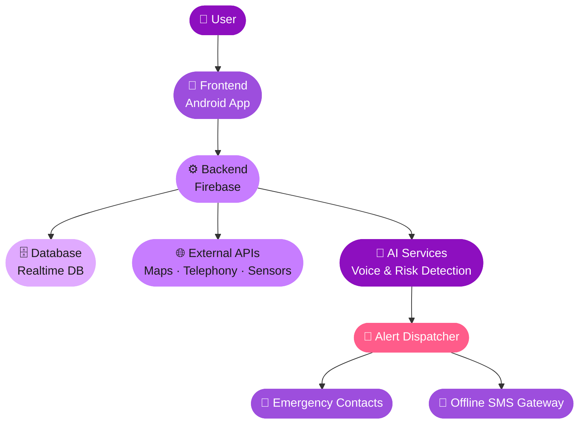
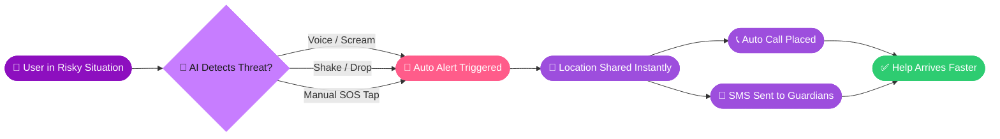
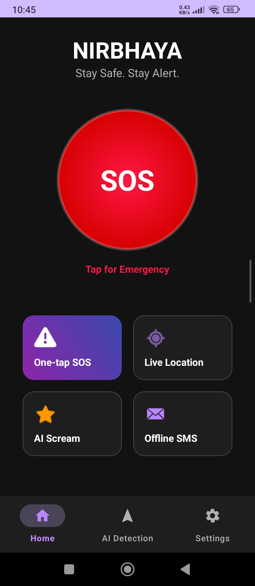
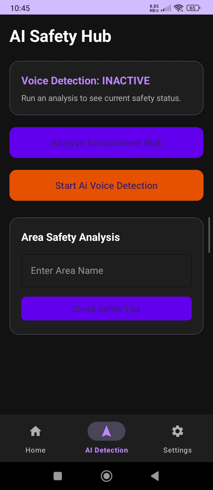
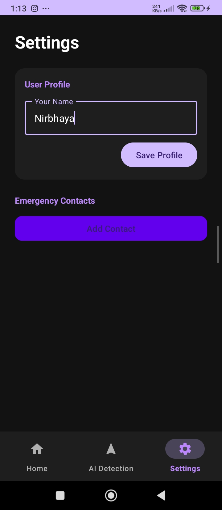
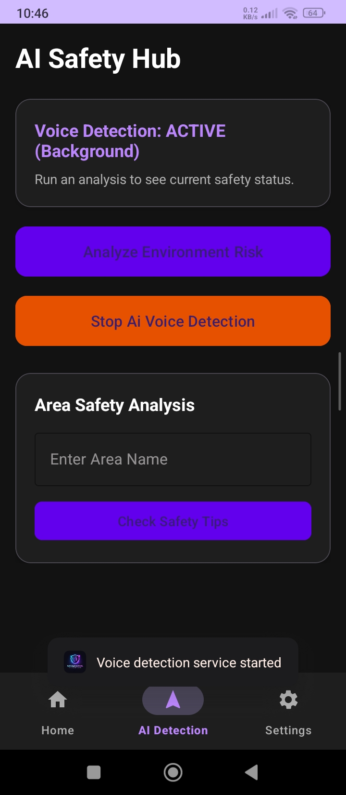
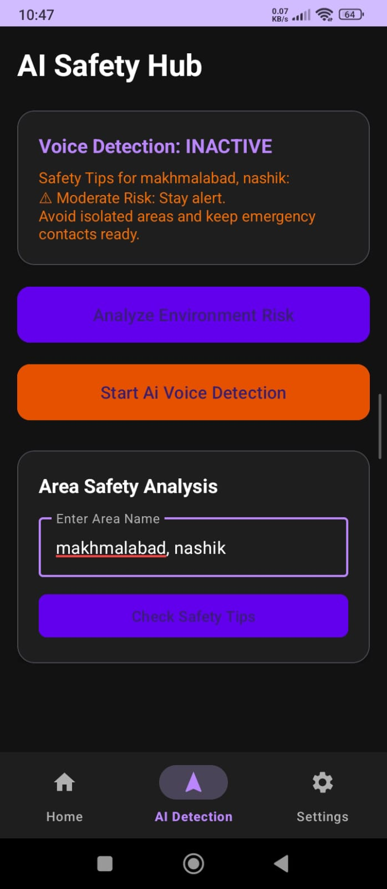
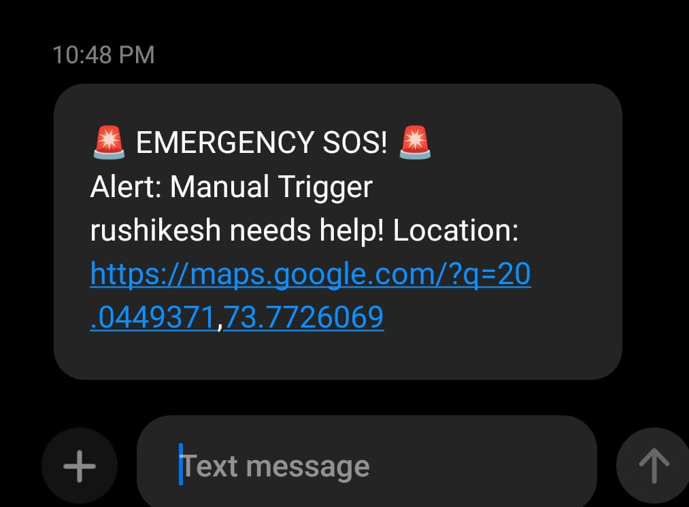

<div align="center">


<a href="https://github.com/rushikesh8877/NIRBHAYA-WOMEN_SAFETY_INTELLIGENCE">
  
</a>

<br/>

[](https://nirbhaya.unaux.com/index.html)
[](https://github.com/rushikesh8877/NIRBHAYA-WOMEN_SAFETY_INTELLIGENCE)
[](#-license)

<br/>


<br/>

[](https://twitter.com/intent/tweet?text=Check%20out%20NIRBHAYA%20-%20an%20AI-powered%20women%20safety%20app!&url=https://github.com/rushikesh8877/NIRBHAYA-WOMEN_SAFETY_INTELLIGENCE)
[](https://www.linkedin.com/sharing/share-offsite/?url=https://github.com/rushikesh8877/NIRBHAYA-WOMEN_SAFETY_INTELLIGENCE)

</div>

<p align="center">
  
</p>

<div align="center">

### "She had seconds... but no way to call for help. NIRBHAYA acts *before* the victim even reacts."

</div>

---

## 📖 Table of Contents

<details open>
<summary>Click to expand</summary>

- [About the Project](#-about-the-project)
- [The Problem](#-the-problem)
- [Key Features](#-key-features)
- [Unique Features](#-unique-features)
- [Tech Stack](#-tech-stack)
- [System Architecture](#-system-architecture)
- [Workflow](#-workflow)
- [Folder Structure](#-folder-structure)
- [Installation](#-installation)
- [Usage](#-usage)
- [Screenshots](#-screenshots)
- [Demo](#-demo)
- [Project Modules](#-project-modules)
- [APIs Used](#-apis-used)
- [Future Enhancements](#-future-enhancements)
- [Challenges Faced](#-challenges-faced)
- [Learnings](#-learnings)
- [Team](#-team)
- [Acknowledgements](#-acknowledgements)
- [Contributing](#-contributing)
- [License](#-license)
- [Support](#-support)

</details>

---

## 🌸 About the Project

**NIRBHAYA — Women Safety Intelligence** is an AI-powered Android safety companion built on a simple belief: *help should arrive before danger escalates, not after.* Most personal-safety apps rely on the victim being calm enough, conscious enough, and quick enough to press a button. In a real emergency, that assumption often fails — panic freezes hands, phones get dropped, and every second lost matters.

NIRBHAYA flips that model. Instead of waiting for a manual trigger, it continuously and intelligently senses distress signals — a scream, a sudden fall, unusual environmental risk — and reacts on its own, sharing live location and alerting trusted contacts automatically, even when the user cannot act.

### 🎯 Why Women's Safety Matters

Safety incidents rarely announce themselves in advance. Existing "safety apps" typically require a manual SOS trigger, offer no real threat verification, and focus entirely on *post-incident* response — by which point the critical window for intervention has already closed. Women navigating unfamiliar streets, late commutes, or unsafe neighborhoods deserve a system that watches out for them proactively, not one that only reacts after they've managed to press a button.

### 💡 Motivation

This project began with one question: *what if help could arrive before danger escalates?* NIRBHAYA was built to close the gap between "manual SOS" and "intelligent, automatic protection" — using nothing more than the sensors already inside every smartphone.

### 🎯 Objectives

- Detect distress **before** the user is able to consciously act
- Trigger emergency alerts and share live location **instantly and automatically**
- Work reliably even in **low-connectivity conditions** via offline SMS fallback
- Require **zero additional hardware** — runs entirely on existing phone sensors
- Stay lightweight, battery-friendly, and always active in the background

### 🔭 Vision

To become the invisible safety layer running quietly on every phone — scaling from an individual safety app into a **connected, AI-driven urban safety network**, integrated with law enforcement, IoT wearables, and smart-city infrastructure by 2030.

<p align="center">
  
</p>

---

## 🕳️ The Problem

```diff
- Manual SOS trigger required — user must be conscious and able to act
- Contact alerts fire only AFTER the trigger, with no real-time intelligence
- No threat verification — every alert is treated as a blind guess
- Zero support for unconscious, panicked, or physically restrained users
- Entirely focused on POST-incident response, not prevention
- Depends on constant internet connectivity to function

+ NIRBHAYA detects threats through AI voice, motion & environment analysis
+ Auto Call + Alert System fires the moment a threat is detected — no tap needed
+ Shake & Drop Detection catches the moment a phone is lost or a struggle begins
+ Works fully in the BACKGROUND, silently, at all times
+ Offline SMS Alert System guarantees delivery even without data connectivity
+ Built for prevention: "From reaction → to protection, in seconds."
```

<div align="center">

| | Existing Safety Apps | NIRBHAYA |
|---|---|---|
| Trigger | ❌ Manual only | ✅ AI-automatic + manual |
| Works unconscious | ❌ No | ✅ Yes |
| Offline support | ❌ Limited/None | ✅ Offline SMS fallback |
| Threat detection | ❌ None | ✅ AI voice + environment analysis |
| Background operation | ⚠️ Inconsistent | ✅ Always-on background service |
| Extra hardware needed | ⚠️ Sometimes | ✅ None |

</div>

---

## ✨ Key Features

<table>
<tr>
<td width="33%">

### 🆘 One-Tap SOS Alert
Instantly triggers an emergency broadcast with live GPS coordinates to all saved emergency contacts.

</td>
<td width="33%">

### 📞 Auto Call + Alert System
Automatically places an emergency call and dispatches alerts the moment a threat is confirmed — no manual step required.

</td>
<td width="33%">

### 📍 Current Location Tracking
Continuously tracks and shares real-time GPS position, speed, and route data with guardians.

</td>
</tr>
<tr>
<td width="33%">

### 🎙️ AI-Based Voice Detection
On-device AI listens for distress sounds and screams using keyword spotting and anomaly detection — entirely on-device, no cloud round-trip needed.

</td>
<td width="33%">

### 📉 Shake & Drop Detection
Sensor-driven detection that recognizes a sudden fall, struggle, or dropped phone and reacts automatically.

</td>
<td width="33%">

### 💬 Offline SMS Alert System
Sends emergency SMS alerts to guardians even without an active internet connection — critical in low-connectivity zones.

</td>
</tr>
<tr>
<td width="33%">

### 👥 Contact Alerts
Notifies every saved emergency contact simultaneously with live status and location updates.

</td>
<td width="33%">

### 🧠 Area Safety & Environment Risk Analysis
Analyzes a named area for safety context and surfaces relevant safety tips before the user heads out.

</td>
<td width="33%">

### 🌙 Works in Background
A persistent background service keeps NIRBHAYA active and monitoring at all times — even with the screen locked.

</td>
</tr>
</table>

> Other supporting modules include **User Authentication**, a personal **Dashboard**, **Real-Time Notifications**, **Safety Tips**, and **Emergency Contact Management** — all built to keep the experience fast under pressure.

<p align="center">
  
</p>

---

## ✨ Unique Features

What sets **NIRBHAYA** apart from typical women-safety apps (including the reference project studied for this README's design):

- 🎙️ **On-device AI Voice & Scream Detection** — real distress-sound recognition running locally, not just a manual SOS button
- 📉 **Shake & Drop Sensor Detection** — reacts to a struggle or a dropped phone without any user input
- 📡 **True Offline-First Alerting** — SMS-based alert delivery designed specifically for low-connectivity conditions, not just an optional fallback
- 🧠 **Proactive Area Risk Analysis** — checks the safety context of a location *before* the user walks into it, rather than only reacting afterward
- 🔋 **Zero Extra Hardware, Always-On** — runs as a lightweight persistent background service using only existing phone sensors

---

## 🛠️ Tech Stack

### Frontend


### Backend


### AI


### APIs & Sensors


### Deployment


<div align="center">

| Layer | Technology | Role in NIRBHAYA |
|---|---|---|
| Frontend | Android (XML + Java/Kotlin) | Native app UI — SOS screen, AI Safety Hub, Settings |
| Backend | Firebase Realtime Database, Auth, Notifications | User data, emergency contacts, live sync, push alerts |
| AI Engine | On-device AI — keyword spotting & anomaly detection | Voice/scream detection and environment risk scoring |
| Maps & Location | Google Maps API | Live location tracking and safe-route context |
| Telephony | Android Telephony API | Auto Call + Alert triggering |
| Sensors | Android Sensor API | Shake & Drop Detection, background motion sensing |
| Supporting | Background Services, Permission Manager, Real-time Alert Handler | Keeps the app active, permission-safe, and responsive |

</div>

---

## 🏗️ System Architecture



---

## 🔄 Workflow



<div align="center">

**From Detection → To Action → In Seconds**

</div>

---

## 📂 Folder Structure

```
NIRBHAYA-WOMEN_SAFETY_INTELLIGENCE/
│
├── app/
│   ├── src/
│   │   ├── main/
│   │   │   ├── java/com/nirbhaya/
│   │   │   │   ├── ui/
│   │   │   │   │   ├── HomeActivity.java        <- SOS, Live Location, AI Scream, Offline SMS
│   │   │   │   │   ├── AiSafetyHubActivity.java <- Voice Detection, Area Safety Analysis
│   │   │   │   │   └── SettingsActivity.java    <- Profile, Emergency Contacts
│   │   │   │   ├── services/
│   │   │   │   │   ├── BackgroundMonitorService.java
│   │   │   │   │   ├── ShakeDropDetector.java
│   │   │   │   │   └── VoiceDetectionService.java
│   │   │   │   ├── ai/
│   │   │   │   │   ├── KeywordSpotter.java
│   │   │   │   │   └── AnomalyDetector.java
│   │   │   │   ├── network/
│   │   │   │   │   ├── FirebaseManager.java
│   │   │   │   │   └── MapsApiClient.java
│   │   │   │   ├── sms/
│   │   │   │   │   └── OfflineSmsAlertSender.java
│   │   │   │   └── utils/
│   │   │   │       └── PermissionManager.java
│   │   │   ├── res/
│   │   │   │   ├── layout/
│   │   │   │   ├── drawable/
│   │   │   │   └── values/
│   │   │   └── AndroidManifest.xml
│   │   └── test/
│   └── build.gradle
│
├── docs/
│   └── images/
│       ├── home.png
│       ├── ai_safety_hub.png
│       ├── sos.png
│       ├── settings.png
│       └── dashboard.png
│
├── gradle/
├── build.gradle
├── settings.gradle
├── LICENSE
└── README.md
```

---

## ⚙️ Installation

### Prerequisites


### 1 — Clone the repository

```bash
git clone https://github.com/rushikesh8877/NIRBHAYA-WOMEN_SAFETY_INTELLIGENCE.git
cd NIRBHAYA-WOMEN_SAFETY_INTELLIGENCE
```

### 2 — Open in Android Studio

Open the project folder in **Android Studio** and let Gradle sync all dependencies.

### 3 — Install dependencies

```bash
./gradlew build
```

### 4 — Configure Firebase

1. Create a project on the [Firebase Console](https://console.firebase.google.com/)
2. Enable **Realtime Database**, **Authentication**, and **Cloud Messaging**
3. Download `google-services.json` and place it inside the `app/` directory

### 5 — Set environment / API keys

Create a `local.properties` (or `secrets.xml`) entry with:

```properties
MAPS_API_KEY=your_google_maps_api_key
FIREBASE_PROJECT_ID=your_firebase_project_id
```

### 6 — Grant required permissions

Ensure the following are enabled at runtime on the device: **Location**, **SMS**, **Microphone**, **Call**, and **Background activity**.

### 7 — Run the app

```bash
./gradlew installDebug
```

Or simply hit **Run ▶** inside Android Studio on a connected device or emulator.

---

## 🚀 Usage

| Module | How to Use |
|---|---|
| **One-Tap SOS** | Tap the red **SOS** button on the Home screen to instantly alert all emergency contacts with your live location. |
| **AI Scream Detection** | Enable **Start AI Voice Detection** in the AI Safety Hub — the app listens in the background and auto-triggers an alert on detecting distress sounds. |
| **Live Location** | Tap **Live Location** to start continuous location sharing with your guardians. |
| **Offline SMS** | Automatically activates when no internet connection is detected, sending SMS alerts directly to saved contacts. |
| **Area Safety Analysis** | Enter an area name in the AI Safety Hub and tap **Check Safety Tips** to review environment risk context before heading out. |
| **Emergency Contacts** | Go to **Settings → Emergency Contacts → Add Contact** to manage your trusted guardian list. |
| **Shake & Drop Detection** | Runs automatically in the background — no setup required once permissions are granted. |

---

## 🖼️ Screenshots

> Add your screenshots to `docs/images/` in the repository — they will render below once uploaded.

<table>
<tr>
<td align="center"><b>Home Screen</b><br/></td>
<td align="center"><b>AI Safety Hub</b><br/></td>
<td align="center"><b>Settings</b><br/></td>
</tr>
<tr>
<td align="center"><b>voice-Detection</b><br/></td>
<td align="center"><b>Area-Analysis </b><br/></td>
<td align="center"><b>Live Location Tracking</b><br/></td>
</tr>
</table>

---

## 🎬 Demo

<div align="center">

[](https://nirbhaya.unaux.com/index.html)
[](https://github.com/rushikesh8877/NIRBHAYA-WOMEN_SAFETY_INTELLIGENCE)
[](#)

</div>

---

## 🧩 Project Modules

<details>
<summary><b>🔐 Authentication</b></summary>
<br/>
Handles user registration and login via Firebase Authentication, and secures access to personal safety data.
</details>

<details>
<summary><b>🆘 SOS</b></summary>
<br/>
Core emergency module — triggers one-tap or AI-automatic alerts, coordinates the auto-call system, and manages alert state.
</details>

<details>
<summary><b>📍 Location Tracking</b></summary>
<br/>
Continuously captures and shares GPS coordinates with guardians using the Google Maps API and Android location services.
</details>

<details>
<summary><b>🧠 AI Engine</b></summary>
<br/>
Runs on-device keyword spotting and anomaly detection for voice/scream recognition, plus environment risk analysis for a given area.
</details>

<details>
<summary><b>📢 Reporting</b></summary>
<br/>
Captures and logs incident reports and alert history for the user's own record and future safety insight.
</details>

<details>
<summary><b>⚙️ Admin / Settings</b></summary>
<br/>
Manages user profile, emergency contact list, and app-level preferences.
</details>

<details>
<summary><b>🔔 Notification</b></summary>
<br/>
Delivers real-time push notifications via Firebase Cloud Messaging and manages the offline SMS alert fallback.
</details>

<details>
<summary><b>🗺️ Maps</b></summary>
<br/>
Integrates the Google Maps API for live tracking, area lookups, and safety-context visualization.
</details>

<details>
<summary><b>🚑 Emergency Services</b></summary>
<br/>
Coordinates the Auto Call + Alert System, dialing emergency contacts directly via the Android Telephony API.
</details>

---

## 🔌 APIs Used

| Purpose | API | Description |
|---|---|---|
| Live Location & Maps | Google Maps API | Renders maps, live tracking, and area-based safety lookups |
| Emergency Calling | Android Telephony API | Places automated emergency calls on threat detection |
| Motion Sensing | Android Sensor API | Powers Shake & Drop Detection using accelerometer data |
| Data & Auth | Firebase Realtime Database / Auth | Stores user data, emergency contacts, and manages secure login |
| Push Notifications | Firebase Cloud Messaging | Delivers real-time alerts and status updates |
| Offline Messaging | Android SMS Manager | Sends emergency SMS alerts without requiring internet access |

---

## 🗺️ Future Enhancements

- [ ] 🤝 Direct **Police Integration** for real-time data sharing and coordinated response
- [ ] ⌚ **IoT Wearable** support for hands-free, phone-free emergency triggers
- [ ] 🏙️ **Smart City Network** integration linking sensors, cameras, and response units
- [ ] 🔮 Advanced **AI Prediction** models for proactive, region-scaled threat forecasting
- [ ] 🌐 Multi-language support for wider accessibility across India
- [ ] 📱 Dedicated **iOS app** alongside the existing Android build
- [ ] 🧭 **Safe Route Recommendation** using historical and live risk data
- [ ] 🗣️ Full voice-command control for hands-free operation

---

## 🧗 Challenges Faced

- Achieving reliable **on-device AI voice detection** without draining battery or requiring constant cloud connectivity
- Keeping a **background service persistently alive** across different Android OEM battery-optimization restrictions
- Designing an **offline-first SMS fallback** that reliably fires even in poor network conditions
- Balancing **sensor sensitivity** for Shake & Drop Detection to avoid false positives during normal phone use
- Managing multiple **runtime permissions** (location, SMS, microphone, call) smoothly without disrupting UX

---

## 📚 Learnings

**Technical:** Building always-on background services on Android, working with on-device AI models for real-time audio analysis, integrating multiple hardware sensors, and designing offline-resilient alerting pipelines using Firebase and native SMS APIs.

**Teamwork:** Coordinating feature ownership across AI, backend, and Android UI in parallel, running structured code reviews, and iterating on the product based on real-world feasibility and viability constraints — not just theoretical design.

---

## 👥 Team

<div align="center">

<table>
<tr>

<td align="center" width="25%">
  
  <br/>
  <b>Om Pachorkar</b>
  <br/>
  <sub>Front-End Developer</sub>
  <br/>
  <a href="https://github.com/OmPachorkar">
    
  </a>
</td>

<td align="center" width="25%">
  
  <br/>
  <b>Vrinda Parjane</b>
  <br/>
  <sub>Lead Android Developer</sub>
  <br/>
  <a href="https://github.com/vrindaparjane">
    
  </a>
</td>

<td align="center" width="25%">
  
  <br/>
  <b>Rushikesh Pingale</b>
  <br/>
  <sub>Back-End Engineer</sub>
  <br/>
  <a href="https://github.com/rushikesh8877">
    
  </a>
</td>

<td align="center" width="25%">
  
  <br/>
  <b>Dibyaranjan Samal</b>
  <br/>
  <sub>Android QA / Automation Engineer</sub>
  <br/>
  <a href="https://github.com/dibyaranjan-samal">
    
  </a>
</td>

</tr>
</table>

</div>

---

## 🙏 Acknowledgements

- Our mentors and faculty for their continuous guidance throughout the development of this project
- The **open-source community** behind Firebase, Android Jetpack, and the on-device AI tooling that made this project possible
- **Google Maps Platform** and the **Android Sensor & Telephony APIs** for making real-time safety features achievable without extra hardware
- Everyone who tested early builds and gave feedback that shaped the final feature set

---

## 🤝 Contributing

Contributions are always welcome — every improvement helps this project protect more people.

1. **Fork** the repository
2. Create your feature branch
   ```bash
   git checkout -b feature/your-feature-name
   ```
3. Commit your changes
   ```bash
   git commit -m "feat: describe your change"
   ```
4. Push to your branch
   ```bash
   git push origin feature/your-feature-name
   ```
5. Open a **Pull Request** describing what you changed and why

Please keep new code consistent with the existing structure, avoid hardcoded credentials, and test on a physical device where possible — sensor-based features don't always behave the same on emulators.

---

## 📄 License

This project is licensed under the **MIT License** — see the [LICENSE](LICENSE) file for details.

```
MIT License — free to use, and distribute, for the safety of every woman who steps out alone.
```

---

## 💖 Support

<div align="center">

[](#)
[](mailto:your.email@example.com)
[](https://github.com/rushikesh8877/NIRBHAYA-WOMEN_SAFETY_INTELLIGENCE/issues)

</div>

---

<div align="center">

**Made with ❤️ for Women's Safety**

*"We built NIRBHAYA for safety... but we hope a day comes when it's never needed."*

🔓 Open Source · Built on GitHub


</div>
